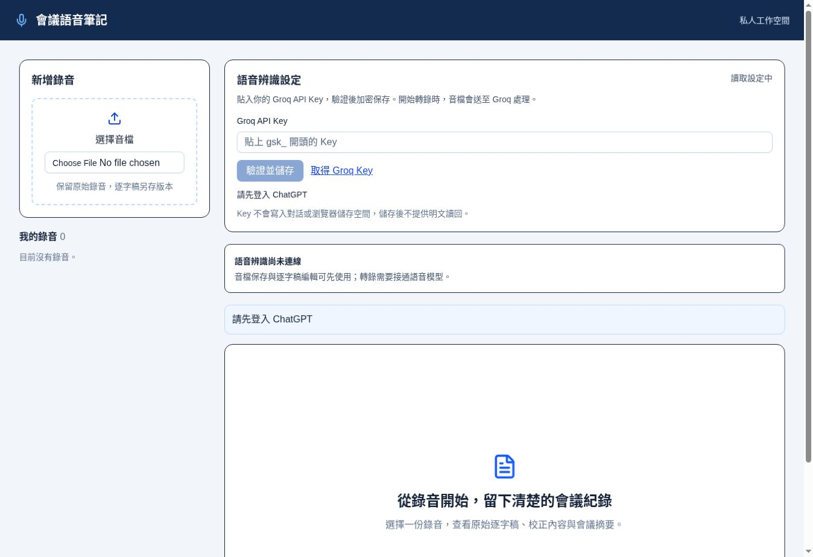

# Audio Notes — 自己的會議自己記！

利用自己的 ChatGPT Work，把錄音整理成逐字稿、專業名詞校正、會議摘要與待辦，資料保存在自己的私人 Sites。

本快照為 **0.1.0 開源候選版**。發布狀態見 [發布紀錄](release/STATUS.md)。尚未通過新帳戶「貼網址到完整附件轉錄」驗收，不稱一鍵即用或 SmallGreen Ready。

## 對象與設定

適合已訂閱 ChatGPT 且帳戶實際具備 Work／Sites 的使用者。定位面向既有 US$20 訂閱者，但價格不保證工具存取權；以當前帳戶為準。

只用 Sites 託管的 Worker、D1、R2，以及本人 Groq Key。不要另申請 Cloudflare 資源或付費模型 API。Key 在部署後的網頁密碼欄輸入，不必交給對話。

## 功能

- 長錄音在 Work 解碼切片，全部上傳後逐片轉錄，保存可續作進度。
- 原稿、校正版、校正紀錄、摘要分開存版本，完成前讀回確認。
- 個人 D1 詞庫保留標準詞、別名、來源；轉錄選相關詞，校正讀完整詞庫。
- 私人會議固定連結與 Markdown 下載；可選交接至 SB、待辦、行事曆、Gmail。
- 額度不足保留佇列，不自動升級付費。

網站本身不會自動產生摘要。MCP 協定程式不等於已提供可新增授權的遠端連線。

## 給 Work 的部署任務

公開 repo 建立並完成來源驗證後，將該網址交給 Work：

> 請讀此專案 AGENTS.md 與 docs/WORK_DEPLOY.md，用我的 Sites 建立私人 Audio Notes，僅用 Sites Worker、D1、R2 與 Groq API。Key 不放對話。部署後交付後台，再分別確認 Key 設定、附件切分、上傳、轉錄、校正、摘要與讀回。沒有合法傳檔授權時，明確回報未完成步驟。

尚未建立公開 repo 前，此段只是交接指引，不是已驗收的公開安裝連結。

## 文件

| 文件 | 內容 |
|---|---|
| [Work 部署](docs/WORK_DEPLOY.md) | 建站、資源、Groq 後台、傳檔授權 |
| [系統架構](docs/ARCHITECTURE.md) | 職責、資料表、資料流、版本 |
| [API 契約](docs/API.md) | 佇列、詞庫、文件、標準回應 |
| [操作與恢復](docs/OPERATIONS.md) | 續作、備份、更新、移除 |
| [限制與驗收](docs/LIMITATIONS.md) | 證據及待驗證條件 |
| [SmallGreen 候選介紹](docs/SMALLGREEN_CANDIDATE.md) | 中英文定位與發布方式 |
| [第三方聲明](THIRD_PARTY_NOTICES.md) | 授權範圍 |

## 現行介面



2026-09-15 擷取現行同版程式的本機預覽，為未登入狀態，未載入真實會議或 Key。此圖不是登入及轉錄成功的驗收證據。

## 開發

依 Sites skill 選 execution profile，使用 package.json 的 Node／pnpm 版本及鎖檔。長音檔另需 Python 3、FFmpeg。

```sh
corepack pnpm install --frozen-lockfile
pnpm exec tsc --noEmit
node tests/workflow.test.mjs
node tests/queue.test.mjs
node tests/remote-mcp.test.mjs
python3 -m unittest discover -s tests -v
pnpm build
```

閱讀 [安全回報](SECURITY.md) 與 [貢獻方式](CONTRIBUTING.md)。自有程式採 MIT，保留第三方聲明。軟體沒有訂閱收費功能，不代表雲端永遠免費。
