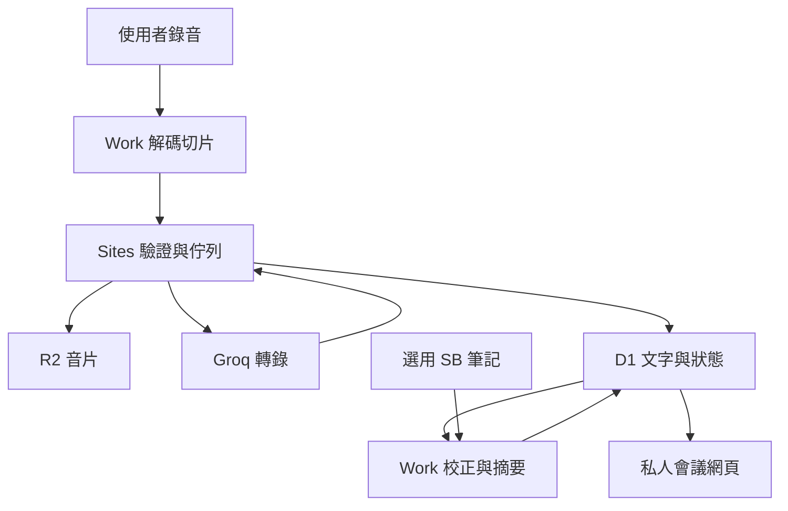

# 系統架構與資料流

Sites Worker 處理 HTTP API、owner 驗證、音片驗收、Groq 呼叫與狀態。Worker 不執行 FFmpeg，也沒有自動摘要模型。公開套件僅支援 Groq，已移除 Workers AI 推論回退。

| 位置 | 內容 |
|---|---|
| R2 prepared | 可獨立解碼 WAV，與 manifest 雜湊一致 |
| R2 original | 另行上傳原音才有；prepared 工作不假稱有原檔 |
| recordings | owner、檔名、大小、狀態 |
| audio_tasks | manifest、提示、佇列狀態、下一次嘗試時間 |
| audio_segments | 順序、位移、時長、R2 key、雜湊、結果、嘗試次數 |
| audio_quota_events／audio_queue_lock | 共用保守額度記帳、租約、供應方等待時間 |
| documents | raw／reviewed／corrections／summary／completion 逐版內容 |
| audio_glossary | owner、標準詞、JSON aliases、來源語境、更新時間 |
| audio_actions | 交辦草稿及外部回執，不自行發送 |
| groq_credentials | owner-bound AES-GCM 密文 |
| chunks | 舊版切片資料；新流程優先 prepared |

新文字存在 D1；舊文件 content 為空時才讀歷史 R2。documents.key 不代表新文件必然另存 R2。文字加 ASR JSON 上限1,500,000 bytes。

## 詞庫

已連接的 SB 工具由 Work 查必要筆記，整理明確標準詞、別名及來源，依使用者要求寫私人 D1。開源包不包含作者詞庫。

轉錄按標準詞、別名、來源語境的字面關鍵字匹配，沒有匹配就不注入；本程式提示上限200字元。校正讀完整詞庫，依語境判斷，不全域替換同音詞、不改寫其他講者口吻。

目前讀取最多500詞、批次最多200詞；單詞更新可修改，批次匯入保留已有詞。沒有背景 SB 同步、詞頻排名、語意索引或自動衝突審查。

## 版本、連結與交辦

儲存生成新版本；四份文件非空且版本與 completion 相符才 verified。文件再更新，舊確認失效。verified 是讀回一致，不代表逐句回聽或外部事實核實。

每場連結為網站 origin 加 `/?meeting=<實際ID>`；分享 URL 不授予別人權限。交辦保留來源版本、交接ID、外部ID、授權依據；發送後回執未保存就中斷仍可能重複，不宣稱 exactly-once。

## 登入與 MCP

身分依 Sites 驗證；不能直接公開在獨立 Worker 並相信外部身份標頭。/mcp 與 stdio 提供協定及操作程式，但第三方 OAuth、授權探索與附件傳輸尚未驗收；私人站點網址不會自動安裝 MCP 工具。
